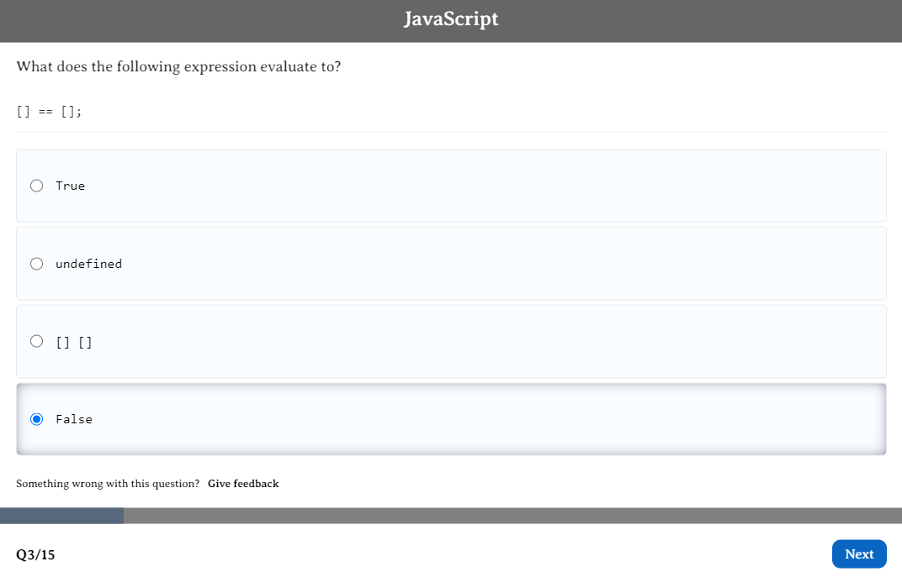

# Linkedin skill assessments quiz 
> 

> This repository is intended for those who want to try their hand at knowing programming languages or technologies before starting a real test on the Linkedin. The source code is located in the src folder.
> 

## Quiz questions:

- Node.js;
- JavaScript;
- MySQL;

**[Start quiz!](https://yevheniiorhanistyi.github.io/Linkedin-skill-assessments-quizze/)**

> All the answers for this test were taken from this repository [Evgenii Ebazhanov](https://github.com/Ebazhanov/linkedin-skill-assessments-quizzes)

